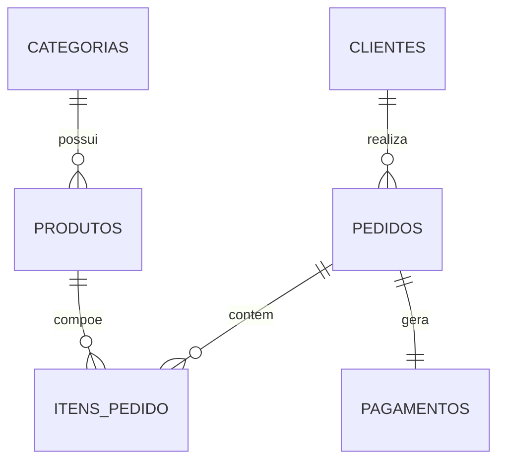

# 📊 Análise de Dados com SQL

**Consultas, tratamento e análise de grandes bases de dados para geração de insights, do `SELECT` ao `GROUP BY`.**

Projeto de portfólio desenvolvido para demonstrar habilidades práticas de **SQL, tratamento de dados (Data Cleaning), análise exploratória e geração de insights de negócio**, utilizando um cenário realista de **E-commerce**.

100% local — roda inteiramente no **VS Code**, sem depender de servidores, APIs ou serviços online.

---

## Sobre o projeto

Este projeto simula o banco de dados de uma loja de e-commerce fictícia (**NovaLoja**), com clientes, produtos, categorias, pedidos, itens de pedido e pagamentos. A partir desses dados, são construídas consultas SQL que vão do nível básico ao avançado, respondendo perguntas reais de negócio — como faturamento, comportamento de clientes e desempenho de produtos.

O projeto foi pensado para reproduzir, na prática, o dia a dia de um analista de dados: entender a base, tratar problemas de qualidade, explorar os dados e transformar consultas em **insights acionáveis**.

## Objetivo

Demonstrar, através de um projeto único e coeso, capacidade de:

- Escrever consultas SQL do básico ao avançado (`SELECT`, `WHERE`, `GROUP BY`, `JOIN`, `CTE`, funções de janela);
- Identificar e tratar problemas de qualidade de dados (Data Cleaning);
- Realizar análise exploratória de dados (EDA) em SQL;
- Responder perguntas de negócio com consultas orientadas a decisão;
- Transformar resultados de consultas em insights escritos e fundamentados em números reais.

## Problema de negócio

A NovaLoja quer entender melhor sua operação de vendas: quais produtos e categorias performam melhor, quem são os clientes mais valiosos, como o faturamento evolui ao longo do tempo e onde existem oportunidades de melhoria. Este projeto usa SQL para responder a essas perguntas diretamente a partir da base transacional da empresa.

## Tecnologias utilizadas

| Tecnologia | Uso no projeto |
|---|---|
| **SQLite** | Banco de dados relacional, 100% local (arquivo `.db`) |
| **SQL** | Toda a análise: consultas, agregações, JOINs, CTEs, window functions |
| **Python** | Apenas para gerar os dados fictícios de forma automática e realista |
| **VS Code** | Editor único utilizado em todo o desenvolvimento |
| **Git / GitHub** | Versionamento e publicação do projeto |

Nenhum servidor, API, banco de dados online, Docker ou serviço de hospedagem é necessário.

## Estrutura do projeto

```text
analise-dados-sql/
│
├── README.md
│
├── database/
│   ├── banco.db              # banco SQLite já criado e populado
│   ├── schema.sql             # criação das tabelas e relacionamentos
│   └── insert_data.sql        # dump completo dos dados (alternativa ao script Python)
│
├── data/
│   └── raw/                   # dados exportados em CSV (auditoria/backup)
│
├── sql/
│   ├── 01_exploracao.sql
│   ├── 02_tratamento.sql
│   ├── 03_consultas_basicas.sql
│   ├── 04_analises_vendas.sql
│   ├── 05_analises_clientes.sql
│   ├── 06_analises_produtos.sql
│   └── 07_analises_avancadas.sql
│
├── scripts/
│   └── gerar_dados.py         # gera e popula o banco com dados realistas
│
├── docs/
│   └── modelo_banco.md        # modelo relacional (com diagrama Mermaid)
│
└── .gitignore
```

## Modelo do banco

O banco é composto por 6 tabelas relacionadas: `categorias`, `produtos`, `clientes`, `pedidos`, `itens_pedido` e `pagamentos`. O diagrama completo, com todas as colunas e relacionamentos, está em [`docs/modelo_banco.md`](docs/modelo_banco.md).



O banco contém dados de **2 anos** de operação simulada (2023–2024), com aproximadamente **186 clientes**, **91 produtos**, **12 categorias** e **3.200 pedidos**.

## Processo de análise

O projeto segue um fluxo de análise em etapas, cada uma em seu próprio arquivo SQL:

1. **Exploração inicial** (`01_exploracao.sql`) — entender volume, período e abrangência da base;
2. **Tratamento de dados** (`02_tratamento.sql`) — identificar e corrigir problemas de qualidade;
3. **Consultas básicas** (`03_consultas_basicas.sql`) — filtros, ordenação e buscas;
4. **Análise de vendas** (`04_analises_vendas.sql`) — faturamento, ticket médio, sazonalidade;
5. **Análise de clientes** (`05_analises_clientes.sql`) — quem compra mais, ranking, retenção;
6. **Análise de produtos** (`06_analises_produtos.sql`) — desempenho de produtos e categorias;
7. **SQL avançado** (`07_analises_avancadas.sql`) — CTEs, subqueries, funções de janela.

## Tratamento dos dados (Data Cleaning)

Os dados gerados contêm, propositalmente, problemas comuns de bases reais, para demonstrar o processo de limpeza em SQL:

- **Valores nulos** — parte dos clientes está sem e-mail ou telefone cadastrado (tratado com `COALESCE`);
- **Registros duplicados** — alguns clientes aparecem com cadastro repetido (tratado agrupando por nome, cidade e data de cadastro);
- **Textos inconsistentes** — cidades e estados com espaços extras ou capitalização irregular (tratado com `TRIM` e `UPPER`);
- **Valores inválidos** — um produto com preço negativo e alguns itens de pedido com quantidade zerada/negativa (excluídos das análises de faturamento via `WHERE`);
- **Pedidos cancelados** — excluídos do cálculo de faturamento realizado, mas mantidos para métricas de cancelamento.

Todo o processo está documentado, com consultas de identificação e de correção, em [`sql/02_tratamento.sql`](sql/02_tratamento.sql).

## Perguntas de negócio (Business Questions)

1. Qual é o faturamento total da empresa?
2. Qual foi o melhor mês em faturamento? E o pior?
3. Como o faturamento evoluiu mês a mês?
4. Qual é o ticket médio dos pedidos?
5. Qual categoria de produto possui maior faturamento?
6. Quais são os 10 produtos mais vendidos?
7. Quais são os 10 produtos que mais geram receita?
8. Quem são os principais clientes da empresa?
9. Qual estado possui maior faturamento?
10. Qual método de pagamento é mais utilizado?
11. Quais clientes possuem maior frequência de compra?
12. Existem produtos com baixa performance (ou que nunca venderam)?
13. Qual é o crescimento percentual do faturamento mês a mês?
14. Qual percentual da receita vem dos 10 maiores clientes?
15. Como as categorias se comparam em participação na receita total?
16. Qual a taxa de cancelamento de pedidos?
17. Existem clientes inativos (sem compra recente)?

## Principais análises

- **Faturamento por período, categoria e estado** (`04_analises_vendas.sql`)
- **Ranking e segmentação de clientes** por valor gasto (`05_analises_clientes.sql`, `07_analises_avancadas.sql`)
- **Curva ABC de produtos**, classificando o catálogo por participação na receita (`07_analises_avancadas.sql`)
- **Crescimento mensal e média móvel de faturamento**, usando `LAG()` e janelas deslizantes (`07_analises_avancadas.sql`)
- **Ranking de produtos por categoria**, usando `RANK() ... PARTITION BY` (`07_analises_avancadas.sql`)

## Principais insights

> Os números abaixo foram calculados diretamente a partir das consultas SQL deste projeto (base 2023–2024).

- O faturamento total realizado (excluindo pedidos cancelados e itens inválidos) foi de **R$ 20.086.757,38**, distribuído em **2.940 pedidos válidos**.
- O ticket médio por pedido é de **R$ 6.867,27**, puxado por categorias de maior valor agregado, como Eletrônicos e Informática.
- **Novembro** foi o mês de maior faturamento nos dois anos analisados (impulsionado pela Black Friday), enquanto os meses de meio de ano (julho a setembro) concentram os menores volumes — evidenciando forte **sazonalidade** nas vendas.
- As categorias **Celulares e Smartphones** e **Informática** lideram o faturamento, respondendo juntas por mais de 20% da receita total da empresa.
- Os estados de **MG, SP e GO** concentram os maiores volumes de faturamento entre os clientes da base.
- **Cartão de Crédito** é o método de pagamento predominante, usado em cerca de **44%** dos pedidos, seguido por Pix (~35%).
- Os **10 maiores clientes** respondem por aproximadamente **9,2%** do faturamento total — uma concentração de receita moderada, sem dependência excessiva de poucos clientes.
- A taxa de cancelamento de pedidos é de aproximadamente **8,1%**, um indicador que vale ser monitorado de perto pela operação.
- Na **Curva ABC** de produtos, 48 produtos (classe A) concentram 80% de toda a receita da empresa — um direcionamento claro de quais itens priorizar em estoque e marketing.

## Como executar o projeto (passo a passo pelo VS Code)

### Pré-requisitos

- [VS Code](https://code.visualstudio.com/) instalado
- [Python 3.10+](https://www.python.org/downloads/) instalado e disponível no PATH
- Git instalado

### Extensões recomendadas do VS Code

| Extensão | Autor | Para quê serve |
|---|---|---|
| **SQLite Viewer** | qwtel | Visualizar o conteúdo do `banco.db` diretamente no VS Code, em formato de tabela |
| **SQLTools** + driver **SQLTools SQLite** | Matheus Teixeira | Executar os arquivos `.sql` diretamente no VS Code e ver o resultado |
| **Python** | Microsoft | Rodar o script `gerar_dados.py` |

> Você só precisa de uma das duas primeiras opções — o SQLite Viewer é o mais simples para apenas visualizar dados, o SQLTools é melhor se quiser rodar os `.sql` com um clique.

### Passo a passo

1. **Clone o repositório e abra a pasta no VS Code**
   ```bash
   git clone https://github.com/SEU-USUARIO/analise-dados-sql.git
   cd analise-dados-sql
   code .
   ```

2. **(Opcional) Regenere o banco de dados**
   O arquivo `database/banco.db` já vem criado e populado. Caso queira gerar os dados novamente (ou gerar uma base diferente), rode:
   ```bash
   python scripts/gerar_dados.py
   ```

3. **Abra o banco de dados**
   Com a extensão *SQLite Viewer* instalada, clique com o botão direito em `database/banco.db` → **Open Database**, ou apenas clique no arquivo.

4. **Execute os scripts SQL**
   - Usando a extensão **SQLTools**: abra qualquer arquivo em `sql/`, conecte na conexão SQLite apontando para `database/banco.db`, e execute cada bloco de consulta (Ctrl+Enter / Cmd+Enter).
   - Alternativa via terminal (se tiver o `sqlite3` instalado no seu sistema):
     ```bash
     sqlite3 database/banco.db
     .read sql/01_exploracao.sql
     ```

5. **Visualize os resultados**
   Os resultados aparecem diretamente na aba de resultados da extensão utilizada, prontos para leitura e print/captura para o portfólio.

## Exemplos de consultas SQL

**Faturamento total da empresa:**
```sql
SELECT ROUND(SUM(ip.quantidade * ip.preco_unitario), 2) AS faturamento_total
FROM itens_pedido ip
JOIN pedidos p ON p.id_pedido = ip.id_pedido
WHERE p.status_pedido <> 'Cancelado'
  AND ip.quantidade > 0;
```

**Top 10 clientes com ranking (window function):**
```sql
WITH gasto_clientes AS (
    SELECT c.nome_cliente, SUM(ip.quantidade * ip.preco_unitario) AS total_gasto
    FROM itens_pedido ip
    JOIN pedidos p ON p.id_pedido = ip.id_pedido
    JOIN clientes c ON c.id_cliente = p.id_cliente
    WHERE p.status_pedido <> 'Cancelado' AND ip.quantidade > 0
    GROUP BY c.id_cliente, c.nome_cliente
)
SELECT ROW_NUMBER() OVER (ORDER BY total_gasto DESC) AS posicao,
       nome_cliente, ROUND(total_gasto, 2) AS total_gasto
FROM gasto_clientes
ORDER BY posicao
LIMIT 10;
```

Mais de 60 consultas comentadas estão disponíveis na pasta [`sql/`](sql/).

## Como publicar no GitHub

```bash
git init
git add .
git commit -m "feat: projeto inicial de análise de dados"
git branch -M main
git remote add origin https://github.com/SEU-USUARIO/analise-dados-sql.git
git push -u origin main
```

> Nenhuma informação sensível (senhas, chaves de API, dados reais de pessoas) é utilizada neste projeto — todos os dados são fictícios e gerados por `scripts/gerar_dados.py`.

## Conclusão

Este projeto demonstra, de ponta a ponta, um fluxo real de análise de dados usando exclusivamente SQL: da modelagem do banco à geração de insights de negócio, passando por tratamento de dados e consultas de complexidade crescente — do `SELECT` básico a funções de janela avançadas. Todo o ambiente roda localmente, sem dependências externas, tornando o projeto fácil de reproduzir, auditar e apresentar em uma entrevista técnica.

---

**Autor:** _seu nome aqui_
**Contato:** _seu LinkedIn / e-mail aqui_
