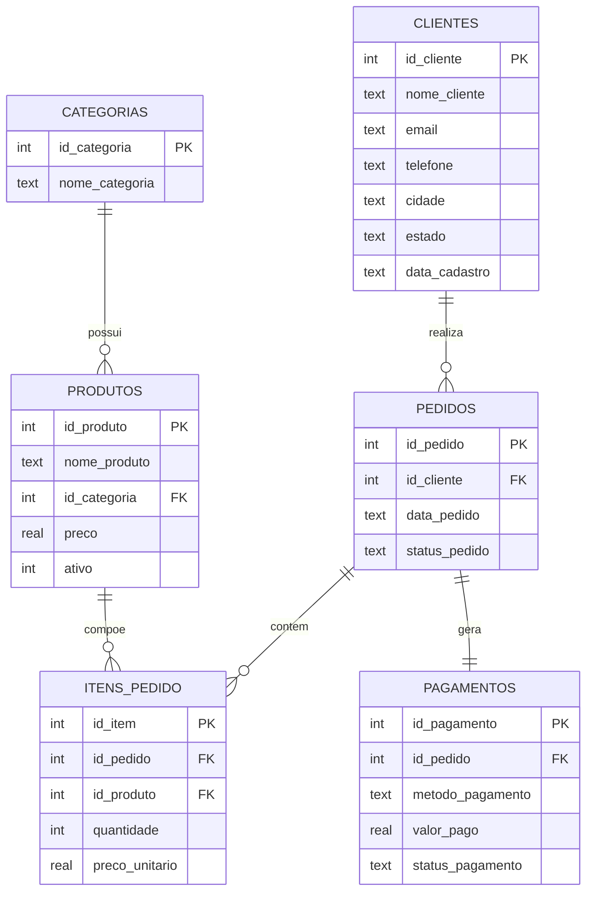

# Modelo do Banco de Dados

Este documento descreve o modelo relacional utilizado no projeto **Análise de Dados com SQL**, um banco de dados SQLite que simula as operações de uma loja de e-commerce fictícia.

## Diagrama Entidade-Relacionamento

## Descrição das tabelas

### `categorias`
Armazena as categorias de produtos vendidos pela loja (ex.: Eletrônicos, Moda Feminina, Livros).

| Coluna          | Tipo | Descrição                    |
|-----------------|------|-------------------------------|
| id_categoria    | INTEGER (PK) | Identificador único da categoria |
| nome_categoria  | TEXT | Nome da categoria             |

### `produtos`
Catálogo de produtos disponíveis para venda. Cada produto pertence a uma categoria.

| Coluna        | Tipo | Descrição                                 |
|---------------|------|---------------------------------------------|
| id_produto    | INTEGER (PK) | Identificador único do produto      |
| nome_produto  | TEXT | Nome do produto                             |
| id_categoria  | INTEGER (FK) | Referencia `categorias.id_categoria` |
| preco         | REAL | Preço de tabela do produto                  |
| ativo         | INTEGER | 1 = ativo / 0 = inativo (fora de linha)  |

### `clientes`
Clientes cadastrados na loja.

| Coluna         | Tipo | Descrição                          |
|----------------|------|---------------------------------------|
| id_cliente     | INTEGER (PK) | Identificador único do cliente |
| nome_cliente   | TEXT | Nome completo                          |
| email          | TEXT | E-mail (pode ser nulo — ver Data Cleaning) |
| telefone       | TEXT | Telefone (pode ser nulo)              |
| cidade         | TEXT | Cidade de residência                  |
| estado         | TEXT | UF (sigla do estado)                  |
| data_cadastro  | TEXT | Data de criação da conta (YYYY-MM-DD) |

### `pedidos`
Cada linha representa um pedido feito por um cliente.

| Coluna         | Tipo | Descrição                                         |
|----------------|------|------------------------------------------------------|
| id_pedido      | INTEGER (PK) | Identificador único do pedido              |
| id_cliente     | INTEGER (FK) | Referencia `clientes.id_cliente`           |
| data_pedido    | TEXT | Data em que o pedido foi realizado (YYYY-MM-DD)     |
| status_pedido  | TEXT | Entregue, Enviado, Em processamento ou Cancelado    |

### `itens_pedido`
Tabela associativa que detalha quais produtos (e em qual quantidade) compõem cada pedido. É a tabela central para o cálculo de faturamento.

| Coluna          | Tipo | Descrição                                  |
|-----------------|------|-----------------------------------------------|
| id_item         | INTEGER (PK) | Identificador único do item          |
| id_pedido       | INTEGER (FK) | Referencia `pedidos.id_pedido`       |
| id_produto      | INTEGER (FK) | Referencia `produtos.id_produto`     |
| quantidade      | INTEGER | Quantidade comprada daquele produto       |
| preco_unitario  | REAL | Preço unitário no momento da compra          |

### `pagamentos`
Registra a forma de pagamento utilizada em cada pedido (relação 1:1 com `pedidos`).

| Coluna            | Tipo | Descrição                                    |
|-------------------|------|--------------------------------------------------|
| id_pagamento      | INTEGER (PK) | Identificador único do pagamento       |
| id_pedido         | INTEGER (FK) | Referencia `pedidos.id_pedido`         |
| metodo_pagamento  | TEXT | Cartão de Crédito, Pix, Boleto ou Cartão de Débito |
| valor_pago        | REAL | Valor total pago no pedido                       |
| status_pagamento  | TEXT | Aprovado, Pendente ou Recusado                   |

## Relacionamentos

- Uma **categoria** possui vários **produtos** (1:N)
- Um **cliente** realiza vários **pedidos** (1:N)
- Um **pedido** contém vários **itens de pedido** (1:N)
- Um **produto** pode aparecer em vários **itens de pedido** (1:N)
- Um **pedido** possui um **pagamento** (1:1)

## Regras de negócio aplicadas nas análises

Para o cálculo de faturamento realizado, todas as consultas de análise desconsideram:

1. Pedidos com `status_pedido = 'Cancelado'`
2. Itens de pedido com `quantidade <= 0` (erro de lançamento, ver `sql/02_tratamento.sql`)
3. Produtos com `preco <= 0` (erro de cadastro)

Essas regras estão documentadas e demonstradas em detalhe no arquivo `sql/02_tratamento.sql`.
